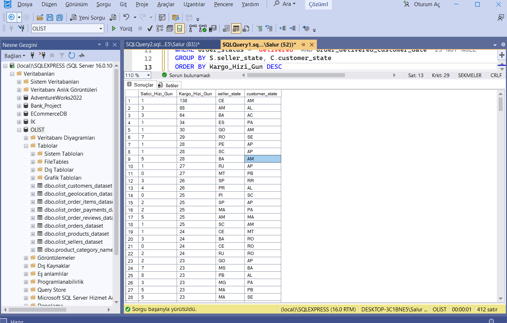

# 📦 Olist E-Ticaret: Teslimat Gecikmesi Kök Neden Analizi (SQL)

Bu proje, **100.000'den fazla** gerçek sipariş verisi içeren Brezilya merkezli Olist E-Ticaret veri seti üzerinde gerçekleştirilmiştir. 

Amaç; artan müşteri şikayetleri üzerine teslimat gecikmelerinin **kök nedenini (root cause)** tespit etmek ve veri odaklı çözüm önerileri sunmaktır.

---

## 🎯 İş Problemi (Business Problem)

Şirket yönetimi, teslimat sürelerindeki sapmaların kaynağını belirlemek istemektedir. Çözülmesi gereken temel soru şudur:

> *"Gecikmelerin sorumlusu ürünleri geç kargolayan **Satıcılar (First Mile)** mı, yoksa taşıma sürecini yönetemeyen **Lojistik Firmaları (Last Mile)** mı?"*

Ayrıca coğrafi olarak hangi rotalarda (Eyalet ➡️ Eyalet) darboğaz yaşandığının raporlanması hedeflenmiştir.

---

## 🛠️ Yöntem ve Teknolojiler


**Veri Seti:** Analiz için birbiriyle ilişkisel 4 farklı tablo (`Orders`, `Order_Items`, `Sellers`, `Customers`) **INNER JOIN** ile birleştirilmiştir.

### Uygulanan Adımlar:

1.  **ETL ve Veri Temizliği:**
    * Ham veri (CSV) SQL Server'a aktarılırken veri tipleri (`NVARCHAR`, `DATETIME`, `FLOAT`) optimize edildi.
    * Hatalı (`NULL`) tarih içeren ve iptal edilen (`canceled`) siparişler analiz dışı bırakıldı.

2.  **KPI Metriklerinin Oluşturulması (`DATEDIFF`):**
    * **Satıcı Hızı (First Mile):** Sipariş Onayı ➡️ Kargoya Veriliş süresi.
    * **Lojistik Hızı (Last Mile):** Kargoya Veriliş ➡️ Müşteriye Teslimat süresi.

3.  **Coğrafi Analiz:**
    * Sonuçlar `GROUP BY` kullanılarak **Satıcı Eyaleti -> Müşteri Eyaleti** rotalarına göre özetlendi.

---

## 💻 SQL Analiz Sorgusu

Analizin merkezini oluşturan, tabloları birleştiren ve metrikleri hesaplayan ana sorgu:

```sql
SELECT 
    AVG(DATEDIFF(day, order_approved_at , order_delivered_carrier_date)) AS Ortalama_Satici_Hizi,
    AVG(DATEDIFF(day, order_delivered_carrier_date, order_delivered_customer_date)) AS Ortalama_Lojistik_Hizi,
    S.seller_state AS Satici_Lokasyon,
    C.customer_state AS Musteri_Lokasyon
FROM 
    olist_orders_dataset O
INNER JOIN 
    olist_order_items_dataset OI ON O.order_id = OI.order_id
INNER JOIN 
    olist_sellers_dataset S ON OI.seller_id = S.seller_id
INNER JOIN 
    olist_customers_dataset C ON O.customer_id = C.customer_id
WHERE 
    order_status = 'delivered' 
    AND order_delivered_customer_date IS NOT NULL
GROUP BY 
    S.seller_state, C.customer_state
ORDER BY 
    Ortalama_Lojistik_Hizi DESC;
---

## 📊 Sonuçlar ve İçgörüler (Insights)

Sorgu sonucunda elde edilen veriler ışığında gecikmelerin ana kaynağı tespit edilmiştir:



1.  **Sorunun Kaynağı:** Satıcıların ürünleri kargoya verme süreleri ortalama **1-3 gün** bandında seyrederken (Başarılı ✅), lojistik tarafında taşıma sürelerinin bazı rotalarda **130 güne** kadar çıktığı görülmüştür (Kritik Sorun 🚨).
2.  **Darboğaz Rotaları:** Özellikle **CE (Ceará)** bölgesinden **AM (Amazonas)** bölgesine giden gönderimlerde ciddi lojistik yetersizliği tespit edilmiştir.

### 📢 Aksiyon Önerisi
Sorun satıcılarda değil, lojistik süreçtedir. Yönetim acilen lojistik partnerini değiştirmeli veya uzak bölgeler (Amazonas gibi) için farklı bir dağıtım stratejisi (örn: yerel depo kiralama) geliştirmelidir.
